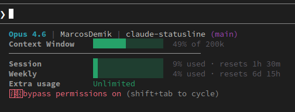

# Claude Code Status Line

Real-time usage monitoring for [Claude Code](https://claude.ai/code) CLI. Shows **actual** session and weekly rate limits from the Anthropic API - not estimates.



```
Opus 4.6 | user | my-project (main) 3 changed
Context Window    ██░░░░░░░░░░░░░  13% of 200k
─────────────────────────────────────────
Session           █░░░░░░░░░░░░░░   7% used · resets 4h 32m
Weekly            █░░░░░░░░░░░░░░   4% used · resets 6d 23h
Extra usage       Unlimited
```

## Features

- **Real data** from `api.anthropic.com/api/oauth/usage` - not heuristics
- **Session** (5h window) and **Weekly** (7d window) usage with reset timers
- **Context window** percentage from Claude Code's internal data
- **Git info** - current branch + changed files count
- **Color-coded bars** - green (<50%), yellow (50-79%), red (>=80%)
- **Smart caching** - API called every 2 min max (avoids 429 rate limits)
- **Cross-platform** - Linux, macOS, and Windows

## Install

### Linux / macOS

```bash
curl -sL https://raw.githubusercontent.com/MarcosDemik/claude-statusline/main/install.sh | bash
```

### Windows (PowerShell)

```powershell
irm https://raw.githubusercontent.com/MarcosDemik/claude-statusline/main/install.ps1 | iex
```

Then restart Claude Code.

### Requirements

| | Linux | macOS | Windows |
|---|---|---|---|
| Claude Code CLI | Yes | Yes | Yes |
| `jq` | `sudo apt install jq` | `brew install jq` | Not needed |
| `curl` | Yes | Yes | Not needed |
| `git` | Optional | Optional | Optional |

## How it works

1. **Context Window** - read from Claude Code's statusline JSON input (exact)
2. **Session / Weekly** - fetched from `api.anthropic.com/api/oauth/usage` using your OAuth token
3. **Cache** - refreshed every 2 minutes to avoid 429 rate limits
   - Linux/macOS: `/tmp/.claude-usage-cache-{uid}.json`
   - Windows: `%TEMP%\.claude-usage-cache.json`
4. **Credentials** - read from:
   - macOS: Keychain (`Claude Code-credentials`) or `~/.claude/.credentials.json`
   - Linux: `~/.claude/.credentials.json`
   - Windows: `%USERPROFILE%\.claude\.credentials.json`

## Uninstall

### Linux / macOS

```bash
rm ~/.claude/statusline-command.sh /tmp/.claude-usage-cache-*.json
```

### Windows

```powershell
Remove-Item "$env:USERPROFILE\.claude\statusline-command.ps1", "$env:TEMP\.claude-usage-cache.json" -ErrorAction SilentlyContinue
```

Then remove the `"statusLine"` key from your `settings.json` (`~/.claude/settings.json`).

## License

MIT
